# **Military Hospital Booking System – Complete Technical Documentation**

## System Overview

**O'verio** is a comprehensive digital transformation platform for Military Hospital of Menoufia, automating the complete patient journey—from registration to appointment booking and complaint management. The system serves **50,000+ active patients** with a focus on fairness, transparency, and operational efficiency.

| Attribute | Value |
|-----------|-------|
| **Organization** | Military Hospital of Menoufia |
| **Platform** | WebApplicationBooking |
| **Document Version** | 3.0 (Consolidated) |
| **Date** | 2025-02-02 |
| **Framework** | ASP.NET Web Forms 4.8.1 · SQL Server · SignalR 2.4.3 · NLog · OWIN |
| **Live System** | http://mnfhosp.com/Default.aspx |

---

## Visual System Walkthrough

Below is a visual guide to the O'verio platform, showcasing its key modules, user flows, and the technical depth of the Operations Center.

### 1. The Public Face & Multi-Channel Access

| 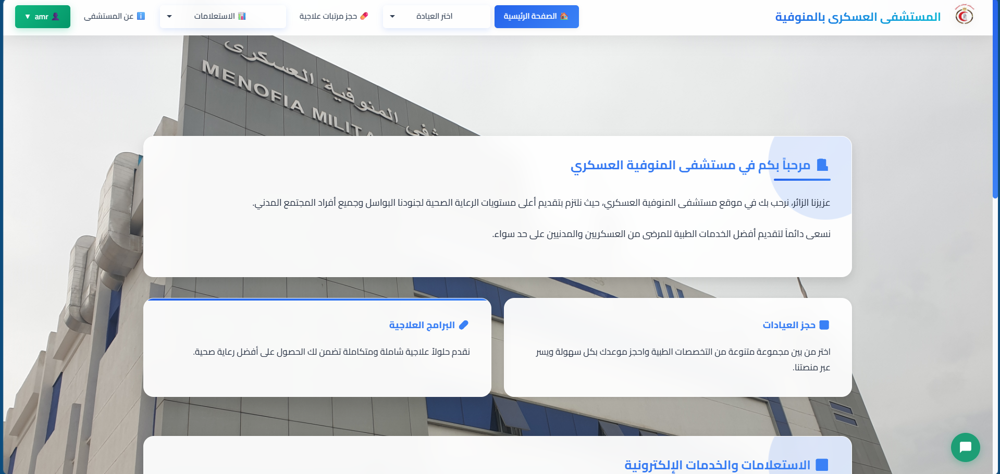 |
| :------------------------------------------------------: |
| **Public Homepage & Smart Entry Points** <br/><br/> The system's landing page provides immediate, role-less access to core actions. *Key features:* direct buttons for Clinic Booking, Medication (Salary) Booking, Appointment Tracking, and Complaint Submission. The design prioritizes the **2-Week Rolling Window** for clinics, ensuring patients see only actionable dates. |

### 2. Patient-Facing Booking & Management

| 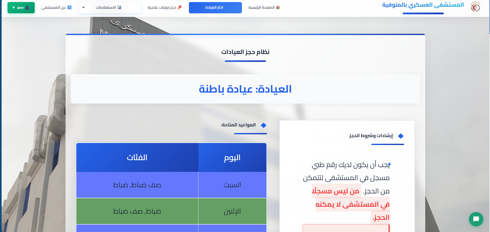 | 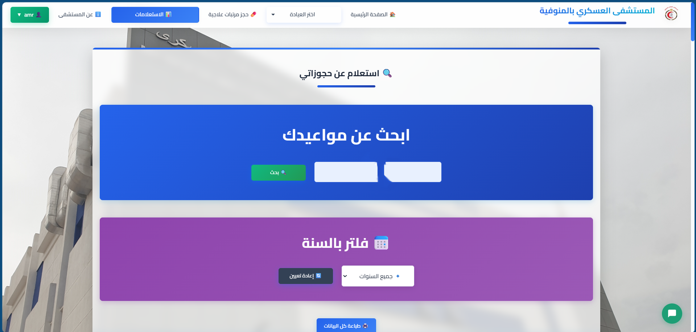 |
| :----------------------------------------------: | :----------------------------------------------------: |
| **Rule-Enforced Clinic Booking** <br/><br/> Patients enter their Medical Number to initiate the `BookingLogic.ValidateBooking()` pipeline. The UI dynamically enforces *Rank-Based Day restrictions*, *Weekly/Monthly limits*, and displays real-time *Clinic Capacity* (Available/Limited/Critical/Full). | **My Appointments – Cancellation with Guardrails** <br/><br/> Patients view all future bookings (Clinic + Salary). The `AppointmentService` enforces the **2 cancellations/month** limit and the **30-hour prior** cutoff. Successful cancellations immediately free up capacity for others. |

### 3. Role-Based Dashboards & Administration

| 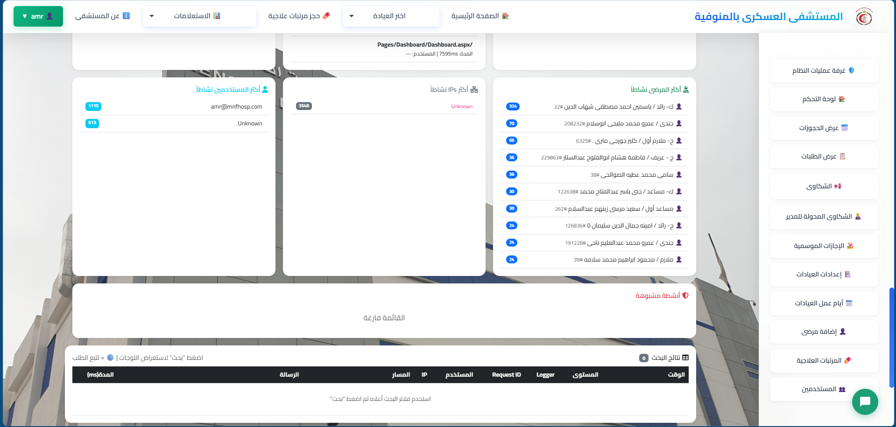 | 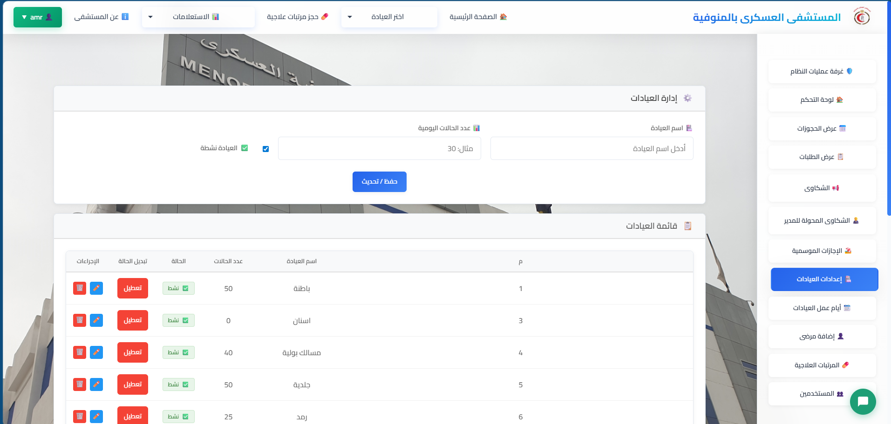 |
| :----------------------------------------------: | :----------------------------------------------------------: |
| **Real-Time Dashboard (Admin/User)** <br/><br/> Powered by `DashboardHub` (SignalR) pushing updates every 60 seconds. Provides instant KPIs: Total Appointments, Pending Registration Requests, Cancellation Rates, and average waiting times. Data sourced from optimized `DashboardRepository` SQL aggregations. | **Admin Control – Clinic & Working Days** <br/><br/> Authorized personnel (Admin only) manage the core entities. Here, `ClinicSettings.aspx` allows CRUD on clinics, capacity adjustments, and activation status. `ClinicWorkingDays.aspx` maps each clinic's `schedule_clinc` (Arabic days) to specific rank categories, a key part of the fairness algorithm. |

### 4. The Core Booking Engine (Complex Transactions)

| 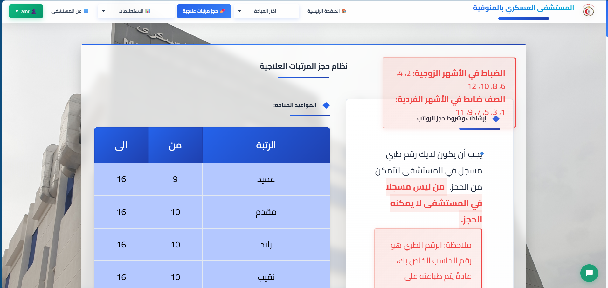 | 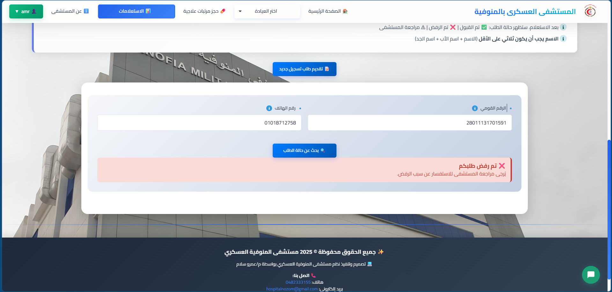 |
| :------------------------------------------------: | :----------------------------------------------------: |
| **Salary (Medication) Dispensing System** <br/><br/> A critical, high-complexity module. The UI enforces *Officer (Even months) vs. Enlisted (Odd months)* rules, checks `settings` table for global toggles, and handles the special **"Catch-up"** logic for patients who missed their primary window. All booked via a **Serializable** transaction to ensure data integrity. | **Patient Registration Request Workflow** <br/><br/> The streamlined onboarding portal. New patients submit required data (Name, 14-digit National ID, 11-digit `01` Phone). Admin uses `RequestsManagement.aspx` to review, de-duplicate using the **Merge Tool**, and approve. This ensures **100% data completeness** (National ID & Phone) for future communication. |

### 5. Advanced Operations Center (LogDashboard)

*These screenshots showcase the system's crown jewel – a real-time, NLog-powered Operations Center for Admins, built with SignalR.*

| 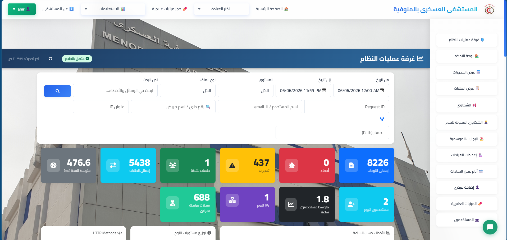 | 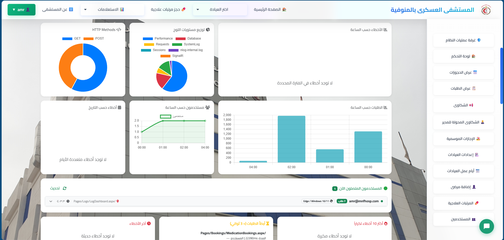 |
| :-------------------------------------------------: | :------------------------------------------------------: |
| **Operations Center – Real-Time System Health** <br/><br/> Accessible only via `CheckSessionForAdmin()`. This dashboard, powered by `LogHub`, `LogReaderService`, and `SecurityWatcherService`, provides live metrics from NLog files. Displays *Active User Sessions*, *Request Error Rates*, *Performance Warnings* (>5 sec), and *Security Alerts* (e.g., brute force detection). | **Advanced Log Tracing & Search** <br/><br/> The `Search` function queries all log files (`SystemLog`, `Errors`, `Requests`, `Performance`, etc.) with caching for performance. The **`GetRequestTrace`** feature reconstructs the entire lifecycle of a single `RequestId`, showing its path through `Application_BeginRequest` to `PostRequestHandlerExecute`. Invaluable for debugging. |

### 6. System-Wide Rules & Configuration

| 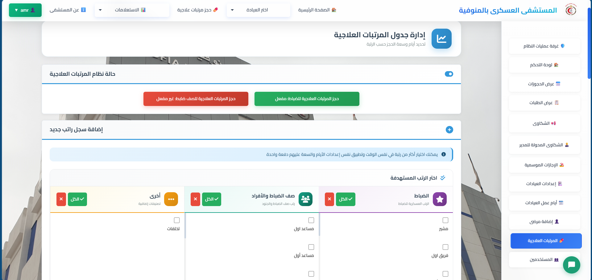 |
| :------------------------------------------------: |
| **Centralized Business Rules Configuration** <br/><br/> An administrative view into the constants that drive the `BookingLogic` engine. Here, authorized users can view/modify settings like `max monthly clinic bookings`, `cancellation limits`, and global `salary booking` toggles (`canbookSalaryOfficer`). This screen represents the shift from hardcoded rules to manageable configuration. |

---

## Table of Contents

### Part I — System Context & Architecture
1. [Strategic Overview & Users](#1-strategic-overview--users)
2. [Technical Architecture & Layers](#2-technical-architecture--layers)
3. [URL Routes & Request Lifecycle](#3-url-routes--request-lifecycle)

### Part II — User Management & Security
4. [Roles, Sessions & Permissions](#4-roles-sessions--permissions)
5. [RBAC & Page Access Matrix](#5-rbac--page-access-matrix)
6. [Authentication & Security](#6-authentication--security)

### Part III — Core Booking Systems
7. [Clinic Appointment System](#7-clinic-appointment-system)
8. [Salary (Medication) Dispensing System](#8-salary-medication-dispensing-system)
9. [Cancellation & Appointment Management](#9-cancellation--appointment-management)
10. [Ranks, Holidays & Schedules](#10-ranks-holidays--schedules)

### Part IV — Additional Modules
11. [Complaints & Public Relations](#11-complaints--public-relations)
12. [Patient Registration Requests](#12-patient-registration-requests)
13. [Dashboard & Analytics](#13-dashboard--analytics)
14. [Admin Settings Modules](#14-admin-settings-modules)

### Part V — Operations Center (LogDashboard)
15. [LogDashboard — Architecture & Flow](#15-logdashboard--architecture--flow)
16. [LogHub & SignalR Integration](#16-loghub--signalr-integration)

### Part VI — Data & Integrations
17. [Data Layer & Database Schema](#17-data-layer--database-schema)
18. [Integration Points](#18-integration-points)

### Part VII — Analysis & Future Roadmap
19. [Technical Analysis & Performance](#19-technical-analysis--performance)
20. [Security Analysis & Recommendations](#20-security-analysis--recommendations)
21. [Future Recommendations (ML.NET)](#21-future-recommendations-mlnet)
22. [Reference Function Matrix](#22-reference-function-matrix)

### Appendices
23. [Business Constants Reference](#23-business-constants-reference)
24. [File Directory Reference](#24-file-directory-reference)

---

# Part I — System Context & Architecture

## 1. Strategic Overview & Users

### 1.1 Strategic Objectives

| Function | Description |
|----------|-------------|
| **Clinic Appointment Booking** | Daily appointments by clinic + rank + capacity |
| **Salary (Medication) Booking** | Monthly appointments (`clinic_id IS NULL` in appointments table) |
| **Patient & Appointment Management** | View, print, delete (Admin only for deletions) |
| **Complaints System** | Patients + PR + Manager workflows |
| **Registration Requests** | New patient registration with tracking by National ID and phone |
| **Dashboard** | Live KPIs via SignalR |
| **Operations Center** | Real-time NLog monitoring + security alerts |

### 1.2 User Types

| Category | Description |
|----------|-------------|
| **Patient / Visitor** | Book without login (clinic, salary, my appointments, complaint, registration request) |
| **User (Employee)** | Dashboard + manage bookings/patients/requests |
| **Pharmacist** | View bookings + salary schedules + patients |
| **Public Relations (PR)** | + PR complaint management |
| **Admin** | Full permissions + operations center + settings |

### 1.3 Core Problems & Solutions

| Problem Area | Old Process | O'verio Solution | Impact |
|--------------|-------------|------------------|---------|
| **Medication Chaos** | Dawn queues, no guarantees | Tiered scheduling by rank + dual slots per patient | Zero queues |
| **Clinic Booking** | Physical visits, no visibility | Rolling 2-week window + rank-based days + 4-booking limit | 24/7 access |
| **Patient Data** | Incomplete records | Mandatory fields + merge tool + registration portal | 100% data integrity |
| **Appointment Cancellations** | Unlimited cancellations | 2/month limit + 30-hour notice required | 60% reduction in no-shows |
| **Duplicate Records** | Multiple entries per patient | National ID uniqueness enforcement + merge tool | Clean database |

---

## 2. Technical Architecture & Layers

### 2.1 Solution Map

```
WebApplicationBooking/
├── Pages/
│   ├── Auth/              Login
│   ├── Bookings/          Clinic · Salary · Schedules
│   ├── Patients/          My Appointments
│   ├── Requests/          Registration Request Tracking
│   ├── Complaints/        3 interface types
│   ├── Dashboard/         Statistics Dashboard
│   ├── Logs/              System Operations Center ★
│   └── Settings/          Settings (Clinics, Holidays, Users, ...)
├── Services/              Business Logic
│   ├── BookingLogic.cs    ★ Core booking engine
│   ├── Hubs/              LogHub · DashboardHub
│   └── ...
├── Data/                  Repositories → SQL
├── Helper/                Auth · Ranks · Performance
├── Models/ + Enums/       DTOs and business states
├── Global.asax.cs         RequestId · NLog MDLC · Timers
├── Startup.cs             OWIN + SignalR
└── NLog.config            Log files ~/Logs/
```

### 2.2 Layer Diagram

```
┌─────────────────────────────────────────────────────────────────────────────┐
│  Presentation: .aspx + .ascx + Scripts/*.js + Site.Master + CSS/JS          │
├─────────────────────────────────────────────────────────────────────────────┤
│  Real-time: SignalR 2.x (OWIN) — DashboardHub | LogHub                       │
├─────────────────────────────────────────────────────────────────────────────┤
│  Application Services: BookingLogic, AppointmentService, ComplaintService   │
├─────────────────────────────────────────────────────────────────────────────┤
│  Data Access: *Repository.cs → ADO.NET / SqlConnection + Stored Procedures  │
├─────────────────────────────────────────────────────────────────────────────┤
│  Cross-cutting: NLog · AuthHelper · PerformanceLogger · Global.asax          │
├─────────────────────────────────────────────────────────────────────────────┤
│  SQL Server: patient_tb, appointments, clinic_tb, schedule_*, complaints    │
└─────────────────────────────────────────────────────────────────────────────┘
```

---

## 3. URL Routes & Request Lifecycle

### 3.1 Official URL Routes (`Global.asax.cs`)

| Route | Page | Audience |
|-------|------|----------|
| `/login` | `Login.aspx` | Public |
| `/dashboard` | `Dashboard.aspx` | Admin, User |
| `/clinic-bookings` | `ClinicBookings.aspx` | Public (+ `?clinic_id=`) |
| `/medication-bookings` | `MedicationBookings.aspx` | Public (salary) |
| `/clinic-schedules` | `ClinicSchedules.aspx` | Public |
| `/patient-appointments` | `PatientAppointments.aspx` | Public/Registered |
| `/requests` | `RequestTracking.aspx` | Public |
| `/complaints` | `PublicRelationsComplaints.aspx` | PR |
| `/complaints-management` | `ComplaintsManagement.aspx` | Admin |
| `/patient-complaints` | `PatientComplaints.aspx` | Public |
| `/settings/*` | Multiple settings pages | Role-dependent |
| `/logs-dashboard` | `LogDashboard.aspx` | Admin |
| `/about` | `AboutUs.aspx` | Public |

### 3.2 Request Lifecycle (Logging Context)

Each HTTP request passes through:

1. **`Application_BeginRequest`** — Generate `RequestId` (12 chars), `SessionId`, `ClientIP`, `UserName` → **NLog MDLC**
2. **`Application_PreRequestHandlerExecute`** — After session:
   - `UserTrackingService.RegisterVisit` (IP+UA fingerprint)
   - `REQUEST_START` → logger `Request`
3. **`Application_PostRequestHandlerExecute`** — `REQUEST_END` + duration; warning if > 5 seconds
4. **`Application_Error`** — `ErrorId` + redirect to `ErrorPage.aspx`

This context is consumed by **LogDashboard** via `LogReaderService.ParseLogLine`.

---

# Part II — User Management & Security

## 4. Roles, Sessions & Permissions

### 4.1 Role Values (`Session["UserType"]`)

Source: `users.a_type` column during login (`AuthenticationService.CreateAuthSession`).

| DB/Session Value | Arabic Name (UI) | Enum `Models.Enums.UserType` |
|------------------|------------------|------------------------------|
| `Admin` | مدير | Admin = 1 |
| `User` | مستخدم | User = 2 |
| `Pharmacist` | صيدلي | Pharmacist = 3 |
| `PR` | علاقات عامة | PR = 4 |

### 4.2 Session Keys

| Key | Purpose |
|-----|---------|
| `UserAccount` | Email `@mnfhosp.com` |
| `UserName` | Display name |
| `UserType` | Role |
| `IsAuthenticated` | `true` after login |
| **Timeout** | **120 minutes** |
| Cookie `UserSession` | 7 days — restored in `Site.Master` |

### 4.3 `AuthHelper` (`Helper/AuthHelper.cs`)

| Function | Behavior |
|----------|----------|
| `CheckSession(List<string> allowedUserTypes)` | Verifies `IsAuthenticated` + role ∈ list; else `~/Default.aspx` |
| `CheckSessionForAdmin()` | `UserType == "Admin"` only |
| `GetCurrentUserName()` | `UserAccount` → Cookie → Identity |

### 4.4 Sidebar Menu (`SidebarButtons.ascx.cs`)

| Menu Item | Admin | User | Pharmacist | PR |
|-----------|:-----:|:----:|:----------:|:--:|
| Operations Center | ✓ | — | — | — |
| General Settings (Holidays) | ✓ | — | — | — |
| Clinics / Working Days | ✓ | — | — | — |
| Salary Schedule | ✓ | — | ✓ | — |
| Users | ✓ | — | — | — |
| Patients / View Bookings | ✓ | ✓ | ✓ | ✓ |
| Registration Requests | ✓ | ✓ | — | ✓ |
| PR Complaints | ✓ | — | — | ✓ |
| Manager Complaints | ✓ | — | — | — |

---

## 5. RBAC & Page Access Matrix

| Page | Server Check | Note |
|------|--------------|------|
| `LogDashboard.aspx` | `CheckSessionForAdmin()` | Operations center |
| `Dashboard.aspx` | Admin or User | |
| `ClinicSettings.aspx` | `CheckSessionForAdmin()` | |
| `MedicationScheduleSettings.aspx` | Admin or Pharmacist | |
| `RequestsManagement.aspx` | Pharmacist blocked | |
| `AppointmentManagement.aspx` | Logged in; bulk delete only Admin | |
| `ClinicBookings` / `MedicationBookings` | Public; Admin bypasses rules | `isAdmin` from Session |
| `PatientAppointments` | Public; cancellation limits apply | |
| `ComplaintsManagement` | **No check in code-behind** | Depends on button visibility — **security gap** |
| `UsersSettings` | **No redirect in Page_Load** | Gap if URL is known |

---

## 6. Authentication & Security

### 6.1 Authentication Flow

```csharp
public LoginResultDto ValidateUser(string account, string password)
{
    var user = _userRepository.GetUserByAccount(account);
    
    // Check for legacy password (plain text, no period)
    if (!user.Password.Contains("."))
    {
        if (user.Password != password)
            return InvalidLogin();
        
        // MIGRATE to hash on first login
        string hashed = PasswordHasher.Hash(password);
        _userRepository.UpdatePassword(user.Id, hashed);
    }
    else
    {
        if (!PasswordHasher.Verify(password, user.Password))
            return InvalidLogin();
    }
    
    CreateAuthSession(user.Account, user.Name, user.AType);
    return SuccessfulLogin();
}
```

### 6.2 Password Hashing (PBKDF2)

```csharp
public static string Hash(string password)
{
    byte[] salt = new byte[16];
    using (var rng = new RNGCryptoServiceProvider())
        rng.GetBytes(salt);
    
    using (var pbkdf2 = new Rfc2898DeriveBytes(password, salt, 100000))
    {
        byte[] hash = pbkdf2.GetBytes(32);
        return $"100000.{Convert.ToBase64String(salt)}.{Convert.ToBase64String(hash)}";
    }
}
```

### 6.3 Security Features

- **PBKDF2** with 100,000 iterations, 16-byte salt, 32-byte hash
- **Legacy password migration** — automatic on first login
- **Session timeout:** 120 minutes with absolute expiration
- **SQL Injection prevention:** All parameterized queries + stored procedures
- **Role-based page access** with `AuthHelper`

---

# Part III — Core Booking Systems

## 7. Clinic Appointment System

### 7.1 Context

- **Page:** `Pages/Bookings/ClinicBookings.aspx` — route `/clinic-bookings?clinic_id={id}`
- **Service:** `BookingLogic` → `BookingRepository`
- **Table:** `appointments` with `clinic_id` NOT NULL
- **Schedule:** `schedule_clinc` (Arabic days + `category` LIKE rank pattern)

### 7.2 Booking Flow Diagram

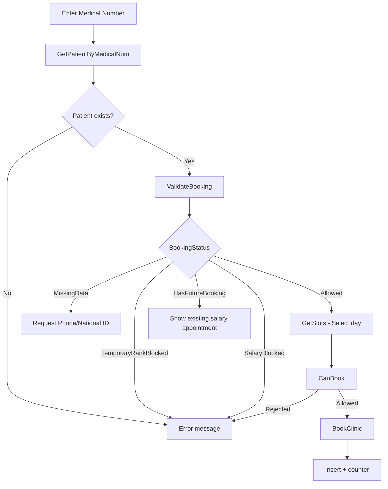

### 7.3 `ValidateBooking` — `BookingStatus` Cases

| Status | Meaning | Who bypasses |
|--------|---------|--------------|
| `Allowed` | Ready to book | — |
| `MissingData` | Missing or duplicate phone/National ID | Admin |
| `TemporaryRankBlocked` | Temporary rank + first booking | Admin |
| `HasFutureBooking` | Future salary appointment (`clinic_id IS NULL`) | — |
| `SalaryBlocked` | `ValidateSalaryBooking` failed | — |

### 7.4 `CanBook` Rules (Non-Admin)

| Rule | Rule Description | Threshold |
|:----:|-----------------|-----------|
| **1** | One booking per same day | Cannot book two clinics on same `selectedDate` |
| **2** | Weekly limit | **≥ 2** bookings per week (Sat→Fri); holidays not counted |
| **5** | Monthly limit | Weeks in month × 2 (`GetMaxMonthlyBookings`) |
| **3** | Future booking same clinic | Blocked until current finishes |
| **0** | Other clinic bookings | **Allowed** with `MessageType=info` |
| — | Admin | `Allowed=true` always |

### 7.5 `GetSlots` — Available Days Display

- From **tomorrow** until end of current week + **7 days** of next week
- **Excludes:** Thursday, Friday, `holiday` dates, days not in `schedule_clinc` for patient's rank
- **Capacity:** `clinic_tb.capacity` − active bookings
- **Display status:** `available` / `limited` (≤40%) / `critical` (≤15%) / `full`

### 7.6 `BookClinic`

- `GetNextCounter` → `-1` = "Clinic is full"
- Estimated arrival time: `9 + floor((counter-1)/50)` hour

### 7.7 Patient Data Validation

| Field | Validation Rule |
|-------|-----------------|
| Phone | 11 digits, starts `01` |
| National ID | 14 digits, starts `2` or `3` |
| National ID uniqueness | Cannot duplicate existing patient (`national_exists`) |

---

## 8. Salary (Medication) Dispensing System

### 8.1 Critical Context

> **"Medication" in routes = Salary (Medication Dispensing)** not a separate medicine table.
> Appointment stored in `appointments` where **`clinic_id IS NULL`**.
> **Page:** `MedicationBookings.aspx` — `/medication-bookings`

### 8.2 Schedule Tables

| Table | Purpose |
|-------|---------|
| `schedule_salary` | `rank`, `from_day`, `to_daye`, `capacity` |
| `settings` | `canbookSalaryOfficer`, `canbookSalaryNotOfficer` |
| Special rank | **"Catch-up (تخلفات)"** — window for those who missed their rank's slot |

### 8.3 Rank-Month Compatibility

| Rank Category | Allowed Month |
|---------------|---------------|
| **Officers** (`IsOfficerRank`) | **Even** months (2,4,6,8,10,12) |
| **NCOs (Enlisted)** | **Odd** months (1,3,5,7,9,11) |

### 8.4 `ValidateSalaryBooking` — Conditions

| # | Condition |
|---|-----------|
| 1 | Current month matches rank category |
| 2 | Settings allow (`canbookSalaryOfficer` / `canbookSalaryNotOfficer`) |
| 3 | **≤ 2** salary bookings in month |
| 4 | **≥ 1 day** between consecutive bookings |
| 5 | Determine `BookingRank`: original rank or **"Catch-up"** based on `HasSalaryRegularBookingThisMonth`, `HasPassedSalaryRegularPeriod`, etc. |

### 8.5 `BookSalaryAppointment`

- Transaction **`Serializable`**
- `InsertSalaryAppointmentAtomic` → `-99` no schedule, `-1` full capacity, `-2` same day
- Admin bypasses most limits

### 8.6 Appointment Time

Same formula as clinics: **`9 + (counter-1)/50`** hour from booking date.

---

## 9. Cancellation & Appointment Management

### 9.1 `AppointmentService` (Default)

| Constant | Value |
|----------|-------|
| `_maxMonthlyCancellations` | **2** / month |
| `_cancellationHoursLimit` | **30** hours before appointment |

### 9.2 `CanCancelAppointment`

```
Appointment date - 30 hours > Current server time → Cancellation allowed
```

### 9.3 Pages

| Page | Function |
|------|----------|
| `PatientAppointments.aspx` | Patient views and cancels appointments (with limits) |
| `AppointmentManagement.aspx` | Employees: view, filter, print, delete (Admin only) |

---

## 10. Ranks, Holidays & Schedules

### 10.1 Rank Categories (`Helper/RankCategories.cs`)

**Officers (sample):** ملازم…مشير, مدني 1–3, طالب كلية حربية, شهيد/محارب ضابط

**NCOs (sample):** جندي…مساعد أول, مدني 4–6, طالب معهد, شهيد/محارب صف ضابط

### 10.2 Temporary Ranks (`IsTemporaryRank`)

Block booking (except Admin): طالب, مدني/مدنى, محارب, شهيد, غير محدد, غير معروف — **on first booking** in `ValidateBooking`.

### 10.3 Holidays (`holiday`)

- `HolidayRepository` / `BookingLogic.GetHolidays`
- Excluded from `GetSlots` and weekly limit counting

### 10.4 Clinic Working Days

- No booking **Thursday/Friday** for clinics
- Working days from `schedule_clinc` matching Arabic day name

---

# Part IV — Additional Modules

## 11. Complaints & Public Relations

### 11.1 Complaint Types (`ComplaintType`)

Complaint · Suggestion · Inquiry · Compliment

### 11.2 Priority (`ComplaintPriority`)

Normal · High · Urgent

### 11.3 Lifecycle (`ComplaintStatus`)

| Value | Arabic | English |
|-------|--------|---------|
| 0 | تم الإرسال | Submitted |
| 1 | تحت المراجعة | Under Review (PR) |
| 2 | محوّلة للمدير | Forwarded to Manager |
| 3 | المدير يراجع | Manager Reviewing |
| 4 | جاري الحل | In Progress |
| 5 | تم الحل | Resolved |
| 6 | مغلقة | Closed |
| 7 | مرفوضة | Rejected |

### 11.4 Complete Workflow

```
PATIENT ──▶ SUBMIT ──▶ STATUS: Submitted (0)
                              │
                              ▼
                    ┌─────────────────────┐
                    │  PR Review & Respond │
                    └─────────────────────┘
                              │
              ┌───────────────┴───────────────┐
              ▼                               ▼
     Normal Resolution              Escalate to Manager
     Status: InProgress (1)         Status: Forwarded (2)
              │                               │
              ▼                               ▼
     Close Complaint               Manager Review
     Status: Closed (6)            Status: ManagerReview (3)
                                          │
                                          ▼
                                    Final Decision
                                    Status: Closed (6)
                                          │
                                          ▼
                                    Patient Rating
                                    (1-5 stars)
```

### 11.5 `ComplaintService.SubmitComplaint`

1. Validate fields
2. `VerifyPatient` (medical number + National ID)
3. **One open complaint per patient**
4. Generate `trackingNo`

### 11.6 Pages

| Page | Audience |
|------|----------|
| `PatientComplaints.aspx` | Patient |
| `PublicRelationsComplaints.aspx` | PR |
| `ComplaintsManagement.aspx` | Manager |

### 11.7 Audit Trail

Every complaint action logged in `ComplaintAuditLog`:
```sql
ComplaintAuditLog (
    Id, ComplaintId, Action, OldStatus, NewStatus, 
    Notes, PerformedBy, PerformedAt
)
```

---

## 12. Patient Registration Requests

### 12.1 Flow

- **Submission:** Form (name, National ID, phone, rank, attribute, guardian medical number…) → `RequestService`
- **Tracking:** `RequestTracking.aspx` — `/requests` — by National ID + phone (same validation: 14 digits, 11 digits phone, `01`)

### 12.2 Management

- `RequestsManagement.aspx` — Approve/Reject — **Pharmacist blocked**

### 12.3 Registration Flow

```
1. New patient submits request via public portal
   ↓
2. Admin reviews request
   ↓
3. System checks against existing records
   ↓
4. If duplicate suspected → Merge Tool consolidates
   ↓
5. Admin approves → Account activated
   ↓
6. Patient receives credentials → Can immediately book
```

---

## 13. Dashboard & Analytics

### 13.1 `Dashboard.aspx` + `DashboardHub`

| Element | Details |
|---------|---------|
| Access | Admin, User |
| Hub | `Services/Hubs/DashboardHub.cs` |
| Client events | `receiveDashboardUpdate`, `receiveError` |
| Groups | By year (`RegisterYear`) |
| Broadcast | `Global.asax` Timer — `DashboardUpdateIntervalMs` default **60000** ms |
| Cache | 30 seconds in Hub |
| Source | `DashboardService` → `DashboardRepository` |

### 13.2 Key Metrics Tracked

| Category | Metrics |
|----------|---------|
| **Requests** | Total, Approved, Rejected, Pending |
| **Patients** | Total, Complete Data, Missing Data, Unbooked |
| **Appointments** | Total, Future, Completed, Cancelled, Clinic vs Salary |
| **Cancellations** | Total, Percentage, Monthly trends |
| **Waiting Times** | Average days between booking and appointment |
| **Complaints** | Total, Open, In Progress, Forwarded, Closed, Satisfaction rating |

### 13.3 Difference from LogDashboard

| | DashboardHub | LogHub |
|---|-------------|--------|
| **Purpose** | Booking/complaint/patient KPIs | NLog files + Security |
| **Audience** | Admin, User | Admin |
| **Source** | SQL aggregations | `~/Logs/*.txt` |

---

## 14. Admin Settings Modules

| Module | Page | Function |
|--------|------|----------|
| Seasonal Holidays | `HolidaySettings.aspx` | CRUD `holiday` |
| Clinics | `ClinicSettings.aspx` | Names, capacity, toggle active |
| Clinic Working Days | `ClinicWorkingDays.aspx` | `schedule_clinc` |
| Salary Schedule | `MedicationScheduleSettings.aspx` | `schedule_salary` + toggle officer/NCO booking |
| Patients | `PatientManagement.aspx` | Search, Excel export |
| Appointments | `AppointmentManagement.aspx` | View all appointments |
| Users | `UsersSettings.aspx` | CRUD `users` |
| Requests | `RequestsManagement.aspx` | Manage `requestForRegistration` |

---

# Part V — Operations Center (LogDashboard)

## 15. LogDashboard — Architecture & Flow

### 15.1 Purpose

Real-time **Operations Center** for Admin: log statistics, search, RequestId tracing, online users, security alerts.

### 15.2 Components

```
LogDashboard.aspx (Auth Admin)
    → logdashboard.js
    → $.connection.logHub
LogHub.cs
    → LogReaderService (reads ~/Logs/)
    → UserTrackingService (live users)
SecurityWatcherService (10s) → AlertAdmins + Telegram
```

### 15.3 SignalR Flow — Statistics

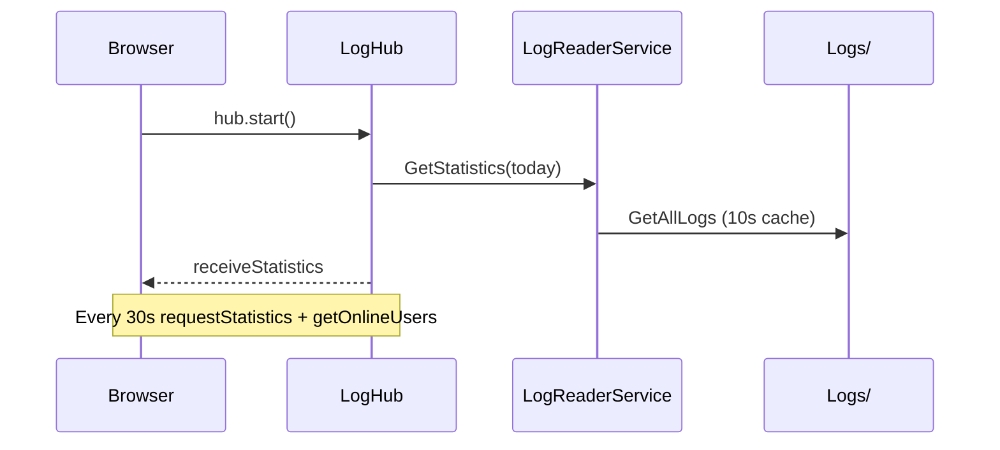

### 15.4 NLog Files

| Logger | File |
|--------|------|
| SystemLog | `SystemLog_{date}.txt` |
| Errors | `Errors_{date}.txt` |
| Requests | `Requests_{date}.txt` |
| Sessions | `Sessions_{date}.txt` |
| SignalR | `SignalR_{date}.txt` |
| Performance | `Performance_{date}.txt` |
| Database | `Database_{date}.txt` |

**Format:** `{longdate} | {LEVEL} | [RequestId] | [User] | [IP] | {message}`

### 15.5 Suspicious Activity Detection

| Type | Condition |
|------|-----------|
| Slow patient query | PERF + `patient_tb` + Duration > 500ms |
| Brute Force | > 5 failed logins/hour from same IP |
| Abnormal error rate | > 10 ERROR/hour for same user |

---

## 16. LogHub & SignalR Integration

### 16.1 LogHub — Connection Management

```csharp
private static ConcurrentDictionary<string, string> _activeSessions; // ConnectionId → UserAccount
public static int LiveActiveCount;
```

| Event | Behavior |
|-------|----------|
| `OnConnected` | Log session, `Groups.Add("Admin")`, `SendStatistics(today)`, `BroadcastActiveCount` |
| `OnDisconnected` | Remove + broadcast count |
| `RequestStatistics` | Statistics by period; `forceRefresh` clears log cache |
| `Search` | Up to **500** results |
| `GetRequestTrace` | RequestId step tree |
| `GetOnlineUsers` | From `UserTrackingService` (**10** minute window) |
| `AlertAdmins` (static) | `receiveLiveSuspiciousAlert` |

### 16.2 LogDashboard.aspx.cs

- **Only:** Check `Session["UserType"]` + `CheckSessionForAdmin()`
- **Does NOT read logs** — all logic via Hub

### 16.3 logdashboard.js — Real-time DOM

| Mechanism | Description |
|-----------|-------------|
| `upsertMainChart` | Update Chart.js without destroy |
| `receiveUserList` | Diff with `data-fp` — preserve collapse state |
| `receiveStatistics` | Counters + 6 charts + lists |
| `receiveLiveSuspiciousAlert` | Sound + banner + toast |
| `setInterval(30000)` | Auto-refresh |
| `hub.disconnected` | Reconnect after 5s |

---

# Part VI — Data & Integrations

## 17. Data Layer & Database Schema

### 17.1 Core Tables

| Table | Purpose |
|-------|---------|
| `patient_tb` | Patient data, rank, medical number |
| `appointments` | Appointments (`clinic_id` NULL = salary) |
| `clinic_tb` | Clinics + `capacity` |
| `schedule_clinc` | Days + rank categories per clinic |
| `schedule_salary` | Salary day window per rank |
| `holiday` | Holidays |
| `settings` | Salary booking settings |
| `users` | Employee accounts |
| `requestForRegistration` | Registration requests |
| `complaints` / `complaint_audit_log` | Complaints and audit trail |

### 17.2 Key Stored Procedures

| Procedure | Purpose |
|-----------|---------|
| `sp_AddPatient` | Insert new patient with validation |
| `sp_UpdatePatient` | Update patient information |
| `sp_DeletePatient` | Remove patient (with checks) |
| `sp_GetAllPatients` | Retrieve all patients |
| `sp_GetUserByAccount` | Authenticate user |
| `sp_ManageSalarySetting` | CRUD for salary schedules |
| `sp_GenerateTrackingNo` | Create unique complaint tracking number |
| `GetSettings` | Retrieve global settings |

### 17.3 Repositories

| Repository | File |
|------------|------|
| BookingRepository | `Data/Bookingrepository.cs` |
| AppointmentRepository | `Data/AppointmentRepository.cs` |
| ClinicRepository | `Data/ClinicRepository.cs` |
| SalaryRepository | `Data/SalaryRepository.cs` |
| PatientRepository | `Data/PatientRepository.cs` |
| ComplaintRepository | `Data/ComplaintRepository.cs` |
| DashboardRepository | `Data/DashboardRepository.cs` |
| UserRepository | `Data/UserRepository.cs` |
| RequestRepository | `Data/RequestRepository.cs` |

### 17.4 Core Services

| Service | Responsibility |
|---------|----------------|
| **BookingLogic** | All booking rules |
| AppointmentService | View/cancel appointments |
| PatientService | Patient search + enrich logs |
| ComplaintService | Complaint lifecycle |
| RequestService | Registration requests |
| DashboardService | Dashboard statistics |
| LogReaderService | Parse + statistics + search |
| UserTrackingService | Live visitors |
| SecurityWatcherService | Alerts |
| LogCleanupService | Delete logs > **10** days every **12** hours |

---

## 18. Integration Points

### 18.1 SignalR (`Startup.cs`)

```csharp
app.MapSignalR(new HubConfiguration { EnableDetailedErrors = true });
```

### 18.2 NLog + Global.asax

- MDLC: `RequestId`, `SessionId`, `ClientIP`, `UserName`
- Loggers: `Request`, `Session`, `SignalRHub`, `Error`, `Performance`

### 18.3 Etisalat SMS

- `EtisalatSMSWebIntegration.aspx` — Individual/Bulk send — **Not integrated into booking flow**

### 18.4 Telegram (SecurityWatcher)

- Scans every **10** seconds with `LogHub.AlertAdmins`
- **Recommendation:** Move `BOT_TOKEN` to `web.config` / Key Vault

---

# Part VII — Analysis & Future Roadmap

## 19. Technical Analysis & Performance

### 19.1 First 9 Months Results

| Metric | Result |
|--------|--------|
| Total Bookings Processed | ~50,000 |
| New Registration Requests | ~10,000 |
| Active Patient Profiles | ~50,000 |
| Booking Fairness | Even weekly distribution |
| Data Completeness | 100% National IDs, 95% phone numbers |
| System Availability | >99.5% |
| Average Response Time | <2 seconds |
| Concurrent Users Supported | 500+ |

### 19.2 LogDashboard Performance Issues

| Cause | Impact |
|-------|--------|
| `GetAllLogs()` reads all files | Heavy I/O |
| Patient enrichment → SQL | N+1 queries |
| 10s cache + `forceRefresh` on update | Full re-read |
| CDN (Bootstrap, Chart.js) | Slow initial load |
| `OnConnected` + page load parallel | Delayed data |

### 19.3 Performance Recommendations

| Priority | Recommendation |
|----------|----------------|
| **High** | Filter log files by date in `GetStatistics` |
| **High** | FileSystemWatcher for cache invalidation |
| **Medium** | In-memory RequestId index with cache |
| **Medium** | Pagination for search (50 instead of 500) |
| **Low** | Redis backplane for SignalR in multi-server |

---

## 20. Security Analysis & Recommendations

### 20.1 Found Gaps

1. `CheckSession(List<>)` not widely used — scattered permissions
2. `ComplaintsManagement` / `UsersSettings` without strict checks
3. LogHub no Admin check on each method
4. Telegram token in source code
5. `CheckSessionForAdmin` redirects to `~/Defult.aspx` (typo)

### 20.2 Security Strengths

- PBKDF2 password hashing (100,000 iterations)
- Legacy password migration
- Parameterized queries throughout
- Session timeout (120 min)
- Role-based page access

### 20.3 Security Recommendations

| Priority | Recommendation |
|----------|----------------|
| **High** | Move Telegram token to `web.config` |
| **High** | Add Admin check to all LogHub methods |
| **High** | Fix redirect typo in `CheckSessionForAdmin` |
| **Medium** | Add server-side checks to `ComplaintsManagement` and `UsersSettings` |
| **Medium** | Implement `[Authorize(Roles="Admin")]` pattern across all pages |

---

## 21. Future Recommendations (ML.NET)

### 21.1 Use Cases

| Model | Inputs | Outputs |
|-------|--------|---------|
| Anomaly Detection | Errors/hour, request duration | Incident alert |
| Clustering | ERROR text | Root cause groups |
| Regression | Requests per hour | Peak prediction |
| Classification | Login failure sequence | Enhanced brute force detection |

### 21.2 Proposed Architecture

```
Logs → ETL (5 min) → Feature Store → ML.NET Train
    → LogPredictionService → LogHub.BroadcastAnomalyScore()
```

### 21.3 Roadmap

| Phase | Duration | Output |
|-------|----------|--------|
| Baseline | 2–3 weeks | CSV features from LogReaderService |
| POC | 3–4 weeks | SrCnn on ErrorsByHour |
| Integration | 2 weeks | "Expected risk" card in Dashboard |
| Feedback | Ongoing | True/False positive classification |

---

## 22. Reference Function Matrix

### 22.1 BookingLogic — Main Public Functions

| Function | Purpose |
|----------|---------|
| `GetPatientByMedicalNum` | Fetch patient + rank category + missing data |
| `ValidateBooking` | Booking gateway: data, temporary rank, future salary, salary |
| `ValidatePatientData` | Phone/National ID/uniqueness |
| `GetSlots` | Available days for clinic + rank |
| `CanBook` | Rules 1,2,5,3,4 |
| `BookClinic` | Insert clinic appointment |
| `ValidateSalaryBooking` | Monthly salary conditions |
| `BookSalaryAppointment` | Insert salary appointment (transaction) |
| `GetSchedules` | Salary schedules for display |
| `SaveContactInfo` | Update phone/National ID |
| `IsOfficerRank` / `IsTemporaryRank` | Rank classification |
| `GetMaxMonthlyBookings` | Weeks × 2 |
| `DetectSuspiciousActivities` | (In LogReaderService) security rules |

### 22.2 LogHub

| Function | Purpose |
|----------|---------|
| `OnConnected` / `OnDisconnected` / `OnReconnected` | Connection lifecycle |
| `RequestStatistics` | Statistics by period |
| `Search` | JSON search |
| `GetRequestTrace` / `GetRequestTraceGroup` | Request tracing |
| `GetOnlineUsers` | List of active users |
| `AlertAdmins` / `BroadcastActiveCount` / `BroadcastStatisticsToAll` | Static broadcast |

### 22.3 logdashboard.js — Main Functions

| Function / Handler | Purpose |
|--------------------|---------|
| `todayStart` / `todayEnd` / `fmt` | Default dates |
| `updateConnectionStatus` | Connection badge |
| `escapeHtml` | XSS prevention |
| `upsertMainChart` + `render*Chart` | Chart.js |
| `receiveStatistics` | Full UI update |
| `receiveUserList` | User list diff |
| `receiveSearchResults` | Search results table |
| `receiveRequestTrace` | Tracing modal |
| `receiveLiveSuspiciousAlert` | Audio alert |
| `setInterval(30s)` | Polling |

### 22.4 Critical DTOs

| DTO | Important Fields |
|-----|------------------|
| `CanBookResult` | `Allowed`, `RuleViolated`, `Message`, `WeeklyAppointments` |
| `BookingValidationResult` | `Status`, `MissingData`, `ArrivalTime`, `BookingRank` |
| `BookResult` / `SalaryBookResult` | `Success`, `Counter`, `Message` |
| `SalaryValidationResult` | `IsValid`, `BookingRank` |
| `PatientInfo` | `Category`, `IsTemporaryRank`, `MissingPhone` |
| `CancellationStatus` | `RemainingCancellations` |
| `LogStatistics` | All operations center fields |

---

## 23. Business Constants Reference

### 23.1 Core Business Constants (Hardcoded)

| Constant | Value |
|----------|-------|
| Clinic weekly limit | 2 |
| Clinic monthly limit | Weeks × 2 |
| Salary monthly limit | 2 |
| Days between salary bookings | 1 day |
| Cancellation monthly limit | 2 |
| Hours before cancellation | 30 |
| Wait time slot size | 50/hour |
| Critical / Limited capacity | 15% / 40% |

### 23.2 Global.asax Constants

| Constant | Value |
|----------|-------|
| `REQUEST_ID_LENGTH` | 12 |
| `ERROR_ID_LENGTH` | 8 |
| `SLOW_REQUEST_SEC` | 5.0 |
| `MEDIUM_REQUEST_SEC` | 2.0 |
| `DEFAULT_INTERVAL_MS` (Dashboard) | 60000 |

### 23.3 Data Validation Rules

| Field | Validation | Format |
|-------|------------|--------|
| Medical Number | Digits only, max 10 chars | `^\d+$` |
| National ID | 14 digits, starts with 2 or 3 | `^[23]\d{13}$` |
| Phone Number | 11 digits, starts with 01 | `^01\d{9}$` |

---

## 24. File Directory Reference

| Topic | Path |
|-------|------|
| Booking Logic | `Services/BookingLogic.cs` |
| Permissions | `Helper/AuthHelper.cs`, `UserControls/SidebarButtons.ascx.cs` |
| Authentication | `Services/AuthenticationService.cs`, `Pages/Shared/Site.Master.cs` |
| Operations Center | `Pages/Logs/LogDashboard.aspx`, `Services/Hubs/LogHub.cs`, `Scripts/logdashboard.js` |
| Log Reading | `Services/LogReaderService.cs` |
| NLog | `NLog.config`, `Global.asax.cs` |
| SignalR | `Startup.cs`, `Services/Hubs/DashboardHub.cs` |

---

## Lessons Learned & Best Practices

### Key Insights

1. **Fairness > Features** — The 2-week rolling window solved more problems than complex features
2. **Data First** — Collecting complete data upfront enables future enhancements
3. **Admin Tools Matter** — Override capabilities are essential for real-world exceptions
4. **Rolling Updates** — Weekly window reset became a predictable, appreciated ritual
5. **Performance at Scale** — SQL Server + stored procedures handle 50k+ records effortlessly
6. **Audit Everything** — Complaint audit trail provides 100% accountability
7. **Real-Time Updates** — SignalR dashboard keeps admins informed instantly

### Technical Best Practices Applied

| Practice | Implementation |
|----------|----------------|
| Separation of Concerns | Business/Data layers clearly separated |
| DRY Principle | Shared validation logic in services |
| Repository Pattern | All database access through repositories |
| Stored Procedures | Complex queries optimized and secured |
| Input Validation | Both client-side and server-side |
| Error Handling | Comprehensive try-catch with user-friendly messages |
| Logging | Audit trail for critical operations |
| Transaction Safety | Serializable transactions for booking |
| Password Hashing | PBKDF2 with salt |
| SQL Injection Prevention | Parameterized queries throughout |

---

**Document Version:** 3.0 (Consolidated)  
**Last Updated:** 2026-06-02  
**System Status:** Production - Live  
**Active Users:** 50,000+ patients  
**Availability:** 99.5%+ uptime  
**Framework:** ASP.NET Web Forms 4.8.1 · SQL Server · SignalR 2.4.3 · NLog · OWIN
```
